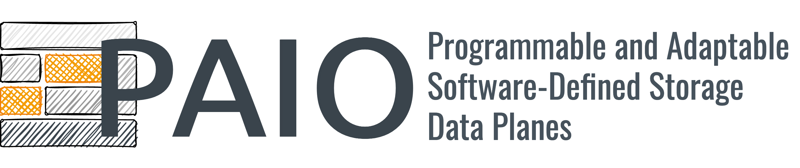

## PAIO
<h1 align="center">
  <!-- logo as of current commit -->
  
  
  
  <a href="https://opensource.org/licenses/BSD-3-Clause">
    
  </a>
</h1>

PAIO is a framework that enables system designers to build custom-made SDS data plane stages.
A data plane stage built with PAIO targets the workflows of a given user-level layer, enabling the
classification and differentiation of requests and the enforcement of different storage mechanisms
according to user-defined storage policies.
Examples of such policies can be as simple as rate limiting greedy tenants to achieve resource
fairness, to more complex ones as coordinating workflows with different priorities to ensure
sustained tail latency.
Check the [full paper](https://www.usenix.org/conference/fast22/presentation/macedo) on PAIO for more details, as well as the [slides](https://www.usenix.org/system/files/fast22_slides_macedo.pdf)
of the FAST'22 talk, which explain the core ideas behind PAIO.

To perform complex I/O optimization outside the application, PAIO needs to propagate context down
the I/O stack. It achieves this by combining ideas from context propagation, enabling
application-level information to be propagated to the data plane stage with minor code changes and
without modifying existing APIs.

PAIO introduces four main abstractions to allow differentiating and mediating I/O request between
user-space layers.
* **Enforcement object** is a programmable component that applies a single user-defined policy, such
as rate limiting, encryption, and compression, to incoming I/O requests.
* **Context object** contains the metadata that characterizes an I/O request, including workflow-id
(`thread-id`), request type (`read`, `open`, `put`, `get`), request size, and request context (which
is used to express additional information of a given request such as `origin`, `context`, and more).
* **Channels** are a stream-like object through where request flow. Each channel contains a set of
*enforcement objects* to apply different mechanisms over the same set of requests, and a
*differentiation rule* that maps requests to the respective object to be enforced.
* **Rules** represent an action that controls the state of a data plane stage. Rules can be defined
through a configuration file or submitted by the control plane, being organized in
*housekeeping rules* (to create and set channels and enforcement objects), *differentiation rules*
(define which type of requests each channel and enforcement object should handle), and
*enforcement rules* (to configure and adjust enforcement objects at runtime/upon workload
variations).

Please cite the [following paper](https://www.usenix.org/conference/fast22/presentation/macedo) if
you use PAIO:

**PAIO: General, Portable I/O Optimizations With Minor Application Modifications**.
Ricardo Macedo, Yusuke Tanimura, Jason Haga, Vijay Chidambaram, José Pereira, João Paulo.
*20th USENIX Conference on File and Storage Technologies (FAST 22)*.

```bibtex
@inproceedings {Macedo2022Paio,
    title     = {{PAIO}: General, Portable {I/O} Optimizations With Minor Application Modifications},
    author    = {Ricardo Macedo and Yusuke Tanimura and Jason Haga and Vijay Chidambaram and Jos{\'e} Pereira and Jo{\~a}o Paulo},
    booktitle = {20th USENIX Conference on File and Storage Technologies},
    year      = {2022},
    isbn      = {978-1-939133-26-7},
    address   = {Santa Clara, CA},
    pages     = {413--428},
    publisher = {USENIX Association},
    url       = {https://www.usenix.org/conference/fast22/presentation/macedo}
}
```


## Getting started with PAIO

This tutorial will guide on how to set up, benchmark, and integrate PAIO.
For more details regarding each of these points, please refer to the [wiki]().

#### Dependencies
PAIO is written with C++17 and was built and tested with `g++-9.3.0` and `cmake-3.16`.
The core library depends on the [spdlog v1.8.1](https://github.com/gabime/spdlog) logging library.
Benchmarking files have a dependency over [gflags v2.2.2](https://github.com/gflags/gflags), a
commandline flag processing library.
Both dependencies are dynamically installed at compile time (check [CMakeLists.txt](CMakeLists.txt)
for details).

#### Set up PAIO
```shell
$ git clone https://github.com/dsrhaslab/paio.git
$ cd paio
$ mkdir build; cd build
$ cmake ..; cmake --build . -j
```

#### Run microbenchmarks
```shell
$ cd build
$ ./paio_bench --threads=4 --size=4096
```

You can adjust the benchmarking parameters using the following command line flags:
* `--runs` defines the number of runs to be conducted;
* `--threads` defines the number of concurrent worker threads to be used;
* `--ops` defines the number of operations for each worker thread to submit;
* `--size` defines the block size of each operation;
* `--wtime` defines the waiting time, in seconds, between runs;
* `--result_path` defines the path to store the performance results (check `store_run_perf_report`
and `store_perf_report` as well).

Check this [page]() for more details.

The final report should be similar to this:
```shell
PAIO:      version 0.1.0
Date:      2022-01-17 08:40:56
CPU:       6 * Intel(R) Core(TM) i5-9500 CPU @ 3.00GHz
CPUCache:  9216 KB
------------------------------------
Setup results: /tmp/paio-results/microbenchmarks-perf-results/micro-perf-results-4-4096
	IOPS (KOps/s):	8365.059
	Thr (GiB/s):	31.910
	stdev-iops:	56.807
	stdev-thr:	0.217
----------------------------------
```

#### Additional benchmarks and tests
The `/benchmarking` and `/tests` directories include a set microbenchmarks and tests to validate the
performance and functionality of the PAIO library.
For instance, the `/benchmarking` directory includes files to the `Noop` and `DynamicRateLimiter`
enforcement objects, and the Murmur hashing scheme, which is used for I/O differentiation.
Check this [page]() for more details.

**Noop benchmark**
```shell
$ ./noop_bench
--------------------------------------------------------
Thread-0: Test Enforcement Object Noop w/ content [1024]
--------------------------------------------------------
Ops:	1000000		Duration: 0.266841
IOPS:	3747.55 KOps/s
------------------------------------------
Thr:	3659.72 MiB/s	3.57394 GiB/s
Bw:	976.562 MiB	0.953674 GiB
--------------------------------------------------------
```

**DynamicRateLimiter benchmark**
```shell
$ ./drl_bench
---------------------------
Configure DynamicRateLimiting object: set new rate
Adjust DRL Rate (50000 -> 100000); OK : 100000 tokens/s
---------------------------
DRL object enforce (100000)
Ops:         1000000	Duration: 10.065770
Est. IOPS:   100000 Ops/s
Real IOPS:   99346.597 Ops/s
---------------------------
DRL test: adjust rate through background thread.
Adjust DRL Rate (100000 -> 39383); OK : 39383 tokens/s
Adjust DRL Rate (39383 -> 30886); OK : 30886 tokens/s
Adjust DRL Rate (30886 -> 42777); OK : 42777 tokens/s
Adjust DRL Rate (42777 -> 36915); OK : 36915 tokens/s
Adjust DRL Rate (36915 -> 47793); OK : 47793 tokens/s
---------------------------
```

**MurmurHash benchmark**
```shell
$ ./murmur_bench
-----------------------------------
Performance of MurmurHash3 x86-32:
-----------------------------------
Ops: 1000000;	 Duration: 0.054
Thr: 18360.4 KOps/s
Lat: 5.446e-08
-----------------------------------
```

### Integrating PAIO in I/O layers
>This is a very brief description on how to use PAIO, and some information may be missing.
> We will update this section as soon as possible, detailing how to create rules (Housekeeping,
> Differentiation, Enforcement) and how to integrate PAIO in I/O layers in more depth.

To use PAIO, first we need to create a data plane stage.
For that, we select of the `PaioStage` constructors, and create it as a `shared_ptr`.
```cpp
// create a PAIO data plane stage
std::shared_ptr<paio::PaioStage> stage {
    std::make_shared<paio::PaioStage> (...)
};

// available PaioStage constructors
PaioStage ();
PaioStage (const int& channels, const bool& default_object_creation, const std::string& stage_name);
PaioStage (const int& channels, const bool& default_object_creation, const std::string& stage_name, const std::string& housekeeping_rules_file_path, const std::string& differentiation_rules_file_path, const std::string& enforcement_rules_file_path, const bool& execute_on_receive);
PaioStage (const int& channels, const bool& default_object_creation, const std::string& stage_name, const CommunicationType& connection_type, const std::string& address, const int& port);
```

Applications do not communicate with PAIO directly through the `PaioStage` object.
Instead, we must create an `InstanceInterface` object that abstracts the use of the data plane stage.
Currently, we allow users to communicate with data plane stages through `paio::PaioInstance` and
`paio::PosixLayer`.

```cpp
// initialize InterfaceInstance-based object
paio::PaioInstance paio_instance (stage);
paio::PosixLayer posix_instance (stage);
```

Finally, we can use the `paio::PaioInstance` object to enforce I/O mechanisms over requests.
Depending on the interface, and the type of granularity that you may want to achieve, you can either
build a `Context` object (which characterizes a given I/O request) and use it to enforce the
request, or you can delegate its creation to the `InstanceInterface` object, using it as a plug-in
replacement of the original I/O calls.

**Plug-in replacement of the original I/O call**
```cpp
// auto return_value = ::read (fd, buffer, size);
auto return_value = posix_instance->read (fd, buffer, size);
```

**Create Context object and enforce as plug-in replacement of the original I/O call**
```cpp
// create a context object and enforce the request
paio::Context context = posix_instance->build_context_object (workflow_id, static_cast<int> (paio::POSIX::read), static_cast<int> (paio::POSIX::noop), size, 1);
// auto return_value = ::read (fd, buffer, size);
auto return_value = posix_instance->read (fd, buffer, size, context);
```

**Create Context object and enforce as a base call**
```cpp
// create a context object and enforce the request
paio::Context context = posix_instance->build_context_object (workflow_id, static_cast<int> (paio::POSIX::read), static_cast<int> (paio::POSIX::noop), size, 1);
auto return_value = posix_instance->posix_base (buffer, size, context);
auto return_value = ::read (fd, buffer, size);
// if using PaioInstance, you can also use the following
Result result {};
auto return_value = paio_instance->enforce (context, buffer, size, result);
auto return_value = ::read (fd, buffer, size);
```

#### Context propagation
Context propagation is useful be propagate information, only known to the application itself, to
the data plane stage.
To achieve this, system designers can instrument the data path of the targeted layer where the
information can be accessed, and make it available to the stage through the process's address space
(e.g., global variables), shared memory, or thread-local variables.
After that, we can use that information to build the `Context` object.

#### Transparent integration
To use PAIO data plane stages transparently, it exposes layer-oriented interfaces (e.g., `PosixLayer`)
and uses `LD_PRELOAD` to replace the original interface calls at the top layer (e.g., read and write
calls invoked by applications) for ones that are first submitted to PAIO before being submitted to
the bottom layer (e.g., file system).
To achieve this, you can create a shared library that exposes the same interface as the target I/O
layer and integrate PAIO over it (the same way as above).

```shell
export PATH_PAIO_ENABLED_LIB=/path/to/paio/enabled/lib.so
LD_PRELOAD=$PATH_PAIO_ENABLED_LIB ./my_targeted_application
```

## Additional information
**Publications about PAIO.**
You can find [here](.docs/publications.md) a list of publications that extend, improve, and use PAIO.

**Enforcement objects.**
We are working on extending the enforcement objects supported by PAIO, including *encryption* and
*compression* schemes, *caches*, and more.
We welcome any feedback and contributions in this topic.

**Research prototype.**
At the moment, this project should be seen as a research prototype.
We believe the tool is not yet ready to be used under a production environment.
We are working hard to address existing issues and improve PAIO to become a production ready tool.


## Acknowledgments
>We thank the [National Institute of Advanced Industrial Science and Technologies (AIST)](https://www.aist.go.jp/index_en.html)
for providing access to computational resources of [AI Bridging Cloud Infrastructure (ABCI)](https://abci.ai/).
>Work realized within the scope of the project [BigHPC](https://bighpc.wavecom.pt)
(POCI-01-0247-FEDER-045924), funded by the European Regional Development Fund, through the
Operational Programme for Competitiveness and Internationalization (COMPETE 2020 Programme) and by
National Funds through the Portuguese Foundation for Science and Technology, I.P. on the scope of
the UT Austin Portugal Program within project [PAStor](https://pastor-project.github.io)
(UTA-EXPL/CA/0075/2019) and PhD Fellowship SFRH/BD/146059/2019.

<p align="center">
    
    
    
</p>


## Contact
Please contact us at `rgmacedo@inesctec.pt` or `jtpaulo@inesctec.pt` with any questions.
